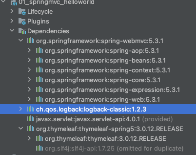

笔记： https://blog.csdn.net/weixin_44751434/article/details/119358203?spm=1001.2014.3001.5501

### 一、SpringMVC简介
#### 1、什么是MVC
MVC是一种软件架构的思想，将软件按照模型、视图、控制器来划分

#####  M：Model，模型层，指工程中的JavaBean，作用是处理数据

JavaBean分为两类：
- 一类称为实体类Bean：专门存储业务数据的，如 Student、User 等
- 一类称为业务处理 Bean：指 Service 或 Dao 对象，专门用于处理业务逻辑和数据访问。

#####  V：View，视图层，指工程中的html或jsp等页面，作用是与用户进行交互，展示数据

#####  C：Controller，控制层，指工程中的servlet，作用是接收请求和响应浏览器

MVC的工作流程：
用户通过视图层发送请求到服务器，在服务器中请求被Controller接收，Controller调用相应的Model层处理请求，处理完毕将结果返回到Controller，Controller再根据请求处理的结果找到相应的View视图，渲染数据后最终响应给浏览器

#### 2、什么是SpringMVC
SpringMVC是Spring的一个后续产品，是Spring的一个子项目

SpringMVC 是 Spring 为表述层开发提供的一整套完备的解决方案。在表述层框架历经 Strust、WebWork、Strust2 等诸多产品的历代更迭之后，目前业界普遍选择了 SpringMVC 作为 Java EE 项目表述层开发的首选方案。

注：三层架构分为表述层（或表示层）、业务逻辑层、数据访问层，表述层表示前台页面和后台servlet

#### 3、SpringMVC的特点
Spring 家族原生产品，与 IOC 容器等基础设施无缝对接
基于原生的Servlet，通过了功能强大的前端控制器DispatcherServlet，对请求和响应进行统一处理
表述层各细分领域需要解决的问题全方位覆盖，提供全面解决方案
代码清新简洁，大幅度提升开发效率
内部组件化程度高，可插拔式组件即插即用，想要什么功能配置相应组件即可
性能卓著，尤其适合现代大型、超大型互联网项目要求

### 二、HelloWorld
#### 1、开发环境
IDE：idea 2022.1.4

构建工具：maven3.6.3

服务器：tomcat9

Spring版本：5.3.1

#### 2、创建maven工程
a>添加web模块
b>打包方式：war
c>引入依赖
```xml
<dependencies>
        <!-- SpringMVC -->
        <dependency>
            <groupId>org.springframework</groupId>
            <artifactId>spring-webmvc</artifactId>
            <version>5.3.1</version>
        </dependency>
        <!-- 日志 -->
        <dependency>
            <groupId>ch.qos.logback</groupId>
            <artifactId>logback-classic</artifactId>
            <version>1.2.3</version>
        </dependency>
        <!-- ServletAPI -->
        <dependency>
            <groupId>javax.servlet</groupId>
            <artifactId>javax.servlet-api</artifactId>
            <version>4.0.1</version>
            <scope>provided</scope> <!-- provided表示已被服务器提供，打包不包 -->
        </dependency>
        <!-- Spring5和Thymeleaf整合包 -->
        <dependency>
            <groupId>org.thymeleaf</groupId>
            <artifactId>thymeleaf-spring5</artifactId>
            <version>3.0.12.RELEASE</version>
        </dependency>
    </dependencies>
```

注：由于 Maven 的传递性，我们不必将所有需要的包全部配置依赖，而是配置最顶端的依赖，其他靠传递性导入。


#### 3、配置web.xml

注册SpringMVC的前端控制器DispatcherServlet

##### a>默认配置方式
此配置作用下，SpringMVC的配置文件默认位于WEB-INF下，默认名称为<servlet-name>-servlet.xml，例如，以下配置所对应SpringMVC的配置文件位于WEB-INF下，文件名为springMVC-servlet.xml

```xml
<!-- 配置SpringMVC的前端控制器，对浏览器发送的请求统一进行处理 -->
<servlet>
    <servlet-name>springMVC</servlet-name>
    <servlet-class>org.springframework.web.servlet.DispatcherServlet</servlet-class>
</servlet>
<servlet-mapping>
    <servlet-name>springMVC</servlet-name>
    <!--
        设置springMVC的核心控制器所能处理的请求的请求路径
        /所匹配的请求可以是/login或.html或.js或.css方式的请求路径
        但是/不能匹配.jsp请求路径的请求
    -->
    <url-pattern>/</url-pattern>
</servlet-mapping>
```


##### b>扩展配置方式
可通过init-param标签设置SpringMVC配置文件的位置和名称，通过load-on-startup标签设置SpringMVC前端控制器DispatcherServlet的初始化时间

```xml
<!-- 配置SpringMVC的前端控制器，对浏览器发送的请求统一进行处理 -->
<servlet>
    <servlet-name>springMVC</servlet-name>
    <servlet-class>org.springframework.web.servlet.DispatcherServlet</servlet-class>
    <!-- 通过初始化参数指定SpringMVC配置文件的位置和名称 -->
    <init-param>
        <!-- contextConfigLocation为固定值 -->
        <param-name>contextConfigLocation</param-name>
        <!-- 使用classpath:表示从类路径查找配置文件，例如maven工程中的src/main/resources -->
        <param-value>classpath:springMVC.xml</param-value>
    </init-param>
    <!-- 
 		作为框架的核心组件，在启动过程中有大量的初始化操作要做
		而这些操作放在第一次请求时才执行会严重影响访问速度
		因此需要通过此标签将启动控制DispatcherServlet的初始化时间提前到服务器启动时
	-->
    <load-on-startup>1</load-on-startup>
</servlet>
<servlet-mapping>
    <servlet-name>springMVC</servlet-name>
    <!--
        设置springMVC的核心控制器所能处理的请求的请求路径
        /所匹配的请求可以是/login或.html或.js或.css方式的请求路径
        但是/不能匹配.jsp请求路径的请求
    -->
    <url-pattern>/</url-pattern>
</servlet-mapping>
```

```plain/text
注：
<url-pattern>标签中使用/和/*的区别：
/所匹配的请求可以是/login或.html或.js或.css方式的请求路径，但是/不能匹配.jsp请求路径的请求
因此就可以避免在访问jsp页面时，该请求被DispatcherServlet处理，从而找不到相应的页面
/*则能够匹配所有请求，例如在使用过滤器时，若需要对所有请求进行过滤，就需要使用/*的写法
```

#### 4、创建请求控制器
由于前端控制器对浏览器发送的请求进行了统一的处理，但是具体的请求有不同的处理过程，因此需要创建处理具体请求的类，即请求控制器

请求控制器中每一个处理请求的方法成为控制器方法

因为SpringMVC的控制器由一个POJO（普通的Java类）担任，因此需要通过@Controller注解将其标识为一个控制层组件，交给Spring的IoC容器管理，此时SpringMVC才能够识别控制器的存在

```java
@Controller
public class HelloController {

}
```

#### 5、创建springMVC的配置文件
```xml
<?xml version="1.0" encoding="UTF-8"?>
<beans xmlns="http://www.springframework.org/schema/beans"
       xmlns:xsi="http://www.w3.org/2001/XMLSchema-instance"
       xmlns:context="http://www.springframework.org/schema/context"
       xmlns:mvc="http://www.springframework.org/schema/mvc"
       xsi:schemaLocation="http://www.springframework.org/schema/beans http://www.springframework.org/schema/beans/spring-beans.xsd
                           http://www.springframework.org/schema/context http://www.springframework.org/schema/context/spring-context.xsd
                           http://www.springframework.org/schema/mvc https://www.springframework.org/schema/mvc/spring-mvc.xsd">

    <!-- 扫描组件 -->
    <context:component-scan base-package="com.atguigu.mvc"/>

    <!-- 配置Thymeleaf视图解析器 -->
    <bean id="viewResolver" class="org.thymeleaf.spring5.view.ThymeleafViewResolver">
        <property name="order" value="1"/>
        <property name="characterEncoding" value="UTF-8"/>
        <property name="templateEngine">
            <bean class="org.thymeleaf.spring5.SpringTemplateEngine">
                <property name="templateResolver">
                    <bean class="org.thymeleaf.spring5.templateresolver.SpringResourceTemplateResolver">
                        <!-- 视图前缀 -->
                        <property name="prefix" value="/WEB-INF/templates/"/>
                        <!-- 视图后缀 -->
                        <property name="suffix" value=".html"/>
                        <property name="templateMode" value="HTML5"/>
                        <property name="characterEncoding" value="UTF-8"/>
                    </bean>
                </property>
            </bean>
        </property>
    </bean>

    <!-- 处理静态资源，例如html、js、css、jpg
        若只设置该标签，则只能访问静态资源，其他请求则无法访问
        此时必须设置<mvc:annotation-driven/>解决问题
    -->
    <mvc:default-servlet-handler/>

    <!-- 开启mvc注解驱动 -->
    <mvc:annotation-driven>
        <mvc:message-converters>
            <!-- 处理响应中文内容乱码 -->
            <bean class="org.springframework.http.converter.StringHttpMessageConverter">
                <property name="defaultCharset" value="UTF-8"/>
                <property name="supportedMediaTypes">
                    <list>
                        <value>text/html</value>
                        <value>application/json</value>
                    </list>
                </property>
            </bean>
        </mvc:message-converters>
    </mvc:annotation-driven>
</beans>
```

#### 6、测试HelloWorld
##### a>实现对首页的访问
在请求控制器中创建处理请求的方法

```java
/**
 * "/" --> http://localhost:8080/01_springmvc_helloworld_war_exploded/WEB-INF/templates/index.html
 * 前缀：/01_springmvc_helloworld_war_exploded/WEB-INF/templates/
 * 后缀：.html
 * @RequestMapping注解：处理请求和控制器方法志坚的映射关系
 * @RequestMapping注解的value属性可以通过请求地址匹配请求,"/"表示的是当前工程的上下文路径
 */
@RequestMapping("/")
public String index() {
    // 设置视图名称
    return "index";
}
```

##### b>通过超链接跳转到指定页面
在主页index.html中设置超链接

```xml
<!DOCTYPE html>
<html lang="en" xmlns:th="http://www.thymeleaf.org">
<head>
    <meta charset="UTF-8">
    <title>首页</title>
</head>
<body>
<h1>首页</h1>
<!--<a href="/<上下文路径>/target">访问目标页面target.html</a>-->
<a th:href="@{/hello}">访问helloWorld.html</a>
</body>
</html>
```

在请求控制器中创建处理请求的方法
```java
@RequestMapping("/hello")
public String hello() {
    return "helloWorld";
}
```
#### 7、总结
浏览器发送请求，若请求地址符合前端控制器的url-pattern，该请求就会被前端控制器DispatcherServlet处理。前端控制器会读取SpringMVC的核心配置文件，通过扫描组件找到控制器，将请求地址和控制器中@RequestMapping注解的value属性值进行匹配，若匹配成功，该注解所标识的控制器方法就是处理请求的方法。处理请求的方法需要返回一个字符串类型的视图名称，该视图名称会被视图解析器解析，加上前缀和后缀组成视图的路径，通过Thymeleaf对视图进行渲染，最终转发到视图所对应页面
