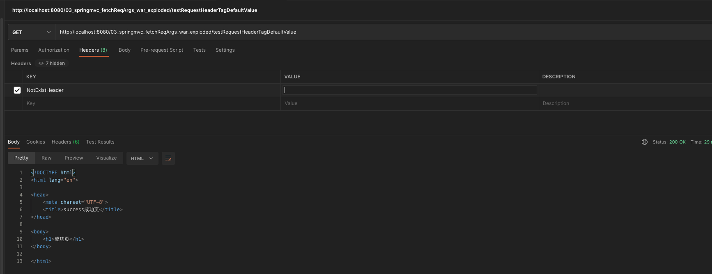

### 四、SpringMVC获取请求参数
#### 1、通过ServletAPI获取
将HttpServletRequest作为控制器方法的形参，此时HttpServletRequest类型的参数表示封装了当前请求的请求报文的对象
```java
@Controller
public class FetchReqArgs_01_OriginServletAPI {

    @RequestMapping("/")
    public String index() {
        return "index";
    }

    // 不推荐用法，用了就是侮辱SpringMVC
    @RequestMapping("/testServletAPI")  // 原生API缺陷无法使用URL占位符方式写
    public String testServletAPI(HttpServletRequest httpServletRequest) {    // 使用Servlet原生接口获取当前请求的请求参数
        String username = httpServletRequest.getParameter("username");
        String password = httpServletRequest.getParameter("password");
        System.out.println("username：" + username + "，password：" + password);
        return "success";
    }
}
```
```html
<h3>通过使用原生HttpServletRequest类的getParameter()方法获取请求参数的值</h3>
<a th:href="@{/testServletAPI(username='admin', password=123456)}">测试使用原生Servlet API获取请求参数的值, "/testServletAPI?username=admin&password=123456" --> success.html</a><br/>
```

#### 2、通过控制器方法的形参获取请求参数
在控制器方法的形参位置，设置和请求参数同名的形参，当浏览器发送请求，匹配到请求映射时，在DispatcherServlet中就会将请求参数赋值给相应的形参
```java
@Controller
public class FetchReqArgs_02_MethodParameter {

    // 通过控制器方法的形参来获取参数
    @RequestMapping("/testParameter")
    public String testParameter(String username, String password) {
        System.out.println("username：" + username + "，password：" + password);
        return "success";
    }

    /**
     * ?username=root&password=123456&hobby=running&hobby=swimming
     * 若请求参数中出现多个同名的请求参数，则可以使用字符串接收（hobby：running,swimming），或使用字符串数组接收（hobby：[running, swimming]）
     *
     * 拓展知识点： 如果用Servlet原生方式写法，获取请求参数里的字符串数组值：httpServletRequest.getParameterValues("hobby");
     */
    @RequestMapping("/testParameterMultiValue")
    public String testParameterMultiValue(String username, String password, String hobby) { // String接收字符串数组
        System.out.println("username：" + username + "，password：" + password + "，hobby：" + hobby);
        return "success";
    }

    @RequestMapping("/testParameterStringArray")
    public String testParameterStringArray(String username, String password, String[] hobby) { // String[]接收字符串数组
        System.out.println("username：" + username + "，password：" + password + "，hobby：" + Arrays.toString(hobby));
        return "success";
    }
}
```
```html
<h3>通过使用controller方法的形参来获取请求参数的值</h3>
<a th:href="@{/testParameter(username='admin', password=123456)}">测试使用controller方法的形参接收参数(username, password), "/testParameter(username='admin', password=123456)" --> success.html</a><br/>
<br/>形参显式声明只接收2个parameters，但如果路径匹配下，传入其他味声明的形参值，也同样能处理请求
<form th:action="@{/testParameter}" method="get">
用户名：<input type="text" name="username"><br/>
密码：<input type="password" name="password"><br/>
爱好：跑步<input type="checkbox" name="hobby" value="running">
游泳<input type="checkbox" name="hobby" value="swimming"><br/>
<input type="submit" value="测试使用controller方法的形参接收参数(username, password, 其他：hobby), '/testParameter?username=root&password=123456&hobby=running&hobby=swimming GET' --> success.html">
</form>
<br/>形参使用String接收"字符串数组"，output: username：root，password：123456，hobby：running,swimming
<form th:action="@{/testParameterMultiValue}" method="get">
用户名：<input type="text" name="username"><br/>
密码：<input type="password" name="password"><br/>
爱好：跑步<input type="checkbox" name="hobby" value="running">
游泳<input type="checkbox" name="hobby" value="swimming"><br/>
<input type="submit" value="测试使用controller方法的形参获取请求参数的值, '/testParameterMultiValue?username=root&password=123456&hobby=running&hobby=swimming GET' --> success.html">
</form>
<br/>形参使用String[]接收"字符串数组"，output: username：root，password：123456，hobby：[running, swimming]
<form th:action="@{/testParameterStringArray}" method="get">
用户名：<input type="text" name="username"><br/>
密码：<input type="password" name="password"><br/>
爱好：跑步<input type="checkbox" name="hobby" value="running">
游泳<input type="checkbox" name="hobby" value="swimming"><br/>
<input type="submit" value="测试使用controller方法的形参获取请求参数的值, '/testParameterStringArray?username=root&password=123456&hobby=running&hobby=swimming GET' --> success.html">
</form>
<hr/>
```
```plain/text
注：
若请求所传输的请求参数中有多个同名的请求参数，此时可以在控制器方法的形参中设置字符串数组或者字符串类型的形参接收此请求参数
若使用字符串数组类型的形参，此参数的数组中包含了每一个数据
若使用字符串类型的形参，此参数的值为每个数据中间使用逗号拼接的结果
```

#### 3、@RequestParam
@RequestParam是将请求参数和控制器方法的形参创建映射关系

@RequestParam注解一共有三个属性：

value：指定为形参赋值的请求参数的参数名

required：设置是否必须传输此请求参数，默认值为true

若设置为true时，则当前请求必须传输value所指定的请求参数，若没有传输该请求参数，且没有设置defaultValue属性，则页面报错400：Required String parameter ‘xxx’ is not present；若设置为false，则当前请求不是必须传输value所指定的请求参数，若没有传输，则注解所标识的形参的值为null

defaultValue：不管required属性值为true或false，当value所指定的请求参数没有传输或传输的值为""时，则使用默认值为形参赋值
```java
@Controller
public class FetchReqArgs_03_RequestParamAnnotation {

    // 前端传过来的请求参数为"user-name"，但形参变量名不允许，引出注解@RequestParam
    @RequestMapping("/testRequestParamTag")
    public String testRequestParamTag(@RequestParam("user-name") String username) {
        System.out.println("username：" + username); // 调用传参数值(user-name=admin)，输出：username：admin
        return "success";
    }

    @RequestMapping("/testRequestParamTagRequired")
    public String testRequestParamTagRequired(@RequestParam(value = "user-name", required = false) String username) {
        System.out.println("username：" + username); // 调用不传参数的输出：username：null
        return "success";
    }

    @RequestMapping("/testRequestParamTagDefaultValue")
    public String testRequestParamTagDefaultValue(@RequestParam(value = "user-name", required = false, defaultValue = "hello") String username) {
        System.out.println("username：" + username); // 调用不传参数的输出：username：hello
        return "success";
    }

    @RequestMapping("/testRequestParamTagDefaultValue2")
    public String testRequestParamTagDefaultValue2(@RequestParam(value = "user-name", required = false, defaultValue = "hello") String username) {
        System.out.println("username：" + username); // 调用传参数(user-name=）的输出：username：hello 【注意：参数值为空，被认为没有传】
        return "success";
    }
}
```
```html
<h3>3. @RequestParam 请求参数名与形参变量名的映射</h3>
<a th:href="@{/testRequestParamTag(user-name=admin)}">前端发送请求参数为"user-name"，控制器方法形参通过注解@RequestParam映射成变量名"username"， "/testRequestParamTag(user-name=admin)" --> success.html</a><br/>
<a th:href="@{/testRequestParamTagRequired}">前端发送请求参数为"user-name"，控制器方法形参通过注解@RequestParam映射成变量名"username"，不传参数required = false（默认true） "/testRequestParamTagRequired" --> success.html</a><br/>
<a th:href="@{/testRequestParamTagDefaultValue}">前端发送请求不传参数为"user-name"，不传参数，默认值hello "/testRequestParamTagDefaultValue" --> success.html</a><br/>
<a th:href="@{/testRequestParamTagDefaultValue2(user-name=)}">前端发送请求参数为"user-name="，值为空，同样认为是没有传参数，默认值hello "/testRequestParamTagDefaultValue2" --> success.html</a><br/>
```

#### 4、@RequestHeader (用法同上)
@RequestHeader是将请求头信息和控制器方法的形参创建映射关系

@RequestHeader注解一共有三个属性：value、required、defaultValue，用法同@RequestParam
```java
@Controller
public class FetchReqArgs_04_RequestHeaderAnnotation {

    /**
     * @RequestHeader 用法同 @RequestParam
     */
    @RequestMapping("/testRequestHeaderTag")
    public String testRequestParamTag(@RequestHeader("Host") String host) {
        System.out.println("host：" + host); // 调用请求header数值，输出：host：localhost:8080
        return "success";
    }

    @RequestMapping("/testRequestHeaderTagRequired")
    public String testRequestParamTagRequired(@RequestHeader(value = "NotExistHeader", required = false) String notExistHeader) {
        System.out.println("NotExistHeader：" + notExistHeader); // 请求中不存在的header，输出：NotExistHeader：null
        return "success";
    }

    @RequestMapping("/testRequestHeaderTagDefaultValue")
    public String testRequestParamTagDefaultValue(@RequestHeader(value = "NotExistHeader", required = false, defaultValue = "hello") String notExistHeader) {
        System.out.println("NotExistHeader：" + notExistHeader); // 请求中不存在的header，输出默认值：NotExistHeader：hello
        return "success";
    }

    @RequestMapping("/testRequestHeaderTagDefaultValue2")
    public String testRequestParamTagDefaultValue2(@RequestHeader(value = "NotExistHeader", required = false, defaultValue = "hello") String notExistHeader) {
        System.out.println("NotExistHeader：" + notExistHeader); // 调用传参数(NotExistHeader=）的输出：NotExistHeader：hello 【注意：header值为空，被认为没有传】
        return "success";
    }
}
```
```html
<h3>4. @RequestHeader 获取请求的header (用法同上)</h3>
<a th:href="@{/testRequestHeaderTag}">前端发送请求header为"Host: localhost:8080"，控制器方法形参通过注解@RequestHeader映射成变量名"host"， "/testRequestHeaderTag" --> success.html</a><br/>
<a th:href="@{/testRequestHeaderTagRequired}">前端发送请求不含header名"NotExistHeader"，控制器方法形参通过注解@RequestHeader映射成变量名映射成变量名"notExistHeader"，不传参数required = false（默认true） "/testRequestHeaderTagRequired" --> success.html</a><br/>
<a th:href="@{/testRequestHeaderTagDefaultValue}">前端发送请求不含header名"NotExistHeader"，设置header "NotExistHeader"默认值hello "/testRequestHeaderTagDefaultValue" --> success.html</a><br/>
<p>Postman测试：前端发送请求带含header名"NotExistHeader"，值为空，同样认为是没有传参数，默认值hello "/testRequestHeaderTagDefaultValue2" --> success.html</p>
<texta style="height: 50px; width:840px"></texta>
<textarea>curl --location --request GET 'http://localhost:8080/03_springmvc_fetchReqArgs_war_exploded/testRequestHeaderTagDefaultValue2' \
--header 'NotExistHeader;'</textarea>
```


#### 5、@CookieValue (用法同上)
@CookieValue是将cookie数据和控制器方法的形参创建映射关系

@CookieValue注解一共有三个属性：value、required、defaultValue，用法同@RequestParam
```java
@Controller
public class FetchReqArgs_05_CookieValueAnnotation {

    /**
     * @RequestHeader 用法同 @RequestParam
     */
    // 执行当前，请求响应头会有cookie： Set-Cookie: JSESSIONID=769D3E95CD894DFAB89B7B055B2FE867; Path=/03_springmvc_fetchReqArgs_war_exploded; HttpOnly
    // 后续请求发送会带当前cookie。
    @RequestMapping("/testCreateSessionCookieAndStoreToBrowser")
    public String testServletAPI(HttpServletRequest httpServletRequest) {    // 使用Servlet原生接口获取当前请求的请求参数
        HttpSession session = httpServletRequest.getSession();
        System.out.println("Creating session cookie to browser, session value:" + session);
        return "success";
    }

    // 执行完上面第一条pre-condition后，执行这条，请求头会带header：Cookie: JSESSIONID=769D3E95CD894DFAB89B7B055B2FE867
    @RequestMapping("/testCookieValueTag")
    public String testRequestParamTag(@CookieValue("JSESSIONID") String jSessionIDCookie) {
        System.out.println("Cookie-JSESSIONID：" + jSessionIDCookie); // Cookie-JSESSIONID：769D3E95CD894DFAB89B7B055B2FE867
        return "success";
    }

    @RequestMapping("/testCookieValueTagRequired")
    public String testRequestParamTagRequired(@CookieValue(value = "NotExistCookieValue", required = false) String notExistCookieValue) {
        System.out.println("notExistCookieValue：" + notExistCookieValue); // notExistCookieValue：null
        return "success";
    }

    @RequestMapping("/testCookieValueTagDefaultValue")
    public String testRequestParamTagDefaultValue(@CookieValue(value = "NotExistCookieValue", required = false, defaultValue = "hello") String notExistCookieValue) {
        System.out.println("notExistCookieValue：" + notExistCookieValue); // NotExistHeader：hello
        return "success";
    }

    @RequestMapping("/testCookieValueTagDefaultValue2")
    public String testRequestParamTagDefaultValue2(@CookieValue(value = "notExistCookieValue", required = false, defaultValue = "hello") String notExistCookieValue) {
        System.out.println("notExistCookieValue：" + notExistCookieValue); // 调用传CookieValue空字符串(notExistCookieValue=）的输出：notExistCookieValue：hello
        return "success";
    }
}
```
```html
<h3>5. @CookieValue 获取请求的cookie (用法同上)</h3>
<a th:href="@{/testCreateSessionCookieAndStoreToBrowser}">原生ServletAPI创建cookie， "/testCreateSessionCookieAndStoreToBrowser" --> success.html</a><br/>
<a th:href="@{/testCookieValueTag}">前端发送请求，获取前端发送请求自带的cookie，控制器方法形参通过注解@CookieValue映射成变量名"cookie"， "/testCookieValueTag" --> success.html</a><br/>
<a th:href="@{/testCookieValueTagRequired}">前端发送请求不含cookie的header名"NotExistCookieValue"，控制器方法形参通过注解@RequestHeader映射成变量名映射成变量名"notExistCookieValue"，不传参数required = false（默认true） "/testCookieValueTagRequired" --> success.html</a><br/>
<a th:href="@{/testRequestHeaderTagDefaultValue}">前端发送请求不含cookie的header名"NotExistCookieValue"，设置cookie "NotExistCookieValue"默认值hello "/testCookieValueTagDefaultValue" --> success.html</a><br/>
<p>Postman测试：前端发送请求带含cookie的header名"NotExistCookieValue"，值为空，同样认为是没有传参数，默认值hello "/testCookieValueTagDefaultValue2" --> success.html</p>
<textarea style="height: 50px; width:840px">curl --location --request GET 'http://localhost:8080/03_springmvc_fetchReqArgs_war_exploded/testCookieValueTagDefaultValue2' \
--header 'Cookie: notExistCookieValue=""'</textarea>
```

#### 6、通过POJO获取请求参数
可以在控制器方法的形参位置设置一个实体类类型的形参，此时若浏览器传输的请求参数的参数名和实体类中的属性名一致，那么请求参数就会为此属性赋值
```java
@Controller
public class FetchReqArgs_06_Pojo {

    @RequestMapping("/testPojo")
    public String testPojo(User user){
        System.out.println(user); //最终结果-->User{id=null, username='root', password='123456', age=23, sex='男', email='123@qq.com'}
        return "success";
    }
}
```
```html
<h3>6. 通过POJO获取请求参数</h3>
<form th:action="@{/testPojo}" method="post">
    用户名：<input type="text" name="username"><br>
    密码：<input type="password" name="password"><br>
    性别：<input type="radio" name="sex" value="男">男<input type="radio" name="sex" value="女">女<br>
    年龄：<input type="text" name="age"><br>
    邮箱：<input type="text" name="email"><br>
    <input type="submit">
</form>
```

#### 7、解决获取请求参数的乱码问题
解决获取请求参数的乱码问题，可以使用SpringMVC提供的编码过滤器CharacterEncodingFilter，但是必须在web.xml中进行注册
```xml
<!--配置springMVC的编码过滤器-->
<filter>
    <filter-name>CharacterEncodingFilter</filter-name>
    <filter-class>org.springframework.web.filter.CharacterEncodingFilter</filter-class>
    <init-param>
        <param-name>encoding</param-name>
        <param-value>UTF-8</param-value>
    </init-param>
    <init-param>
        <param-name>forceResponseEncoding</param-name>
        <param-value>true</param-value>
    </init-param>
</filter>
<filter-mapping>
    <filter-name>CharacterEncodingFilter</filter-name>
    <url-pattern>/*</url-pattern>
</filter-mapping>
```
```plain/text
注：
SpringMVC中处理编码的过滤器一定要配置到其他过滤器之前，否则无效
```