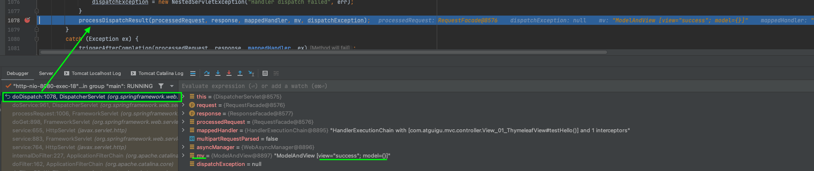
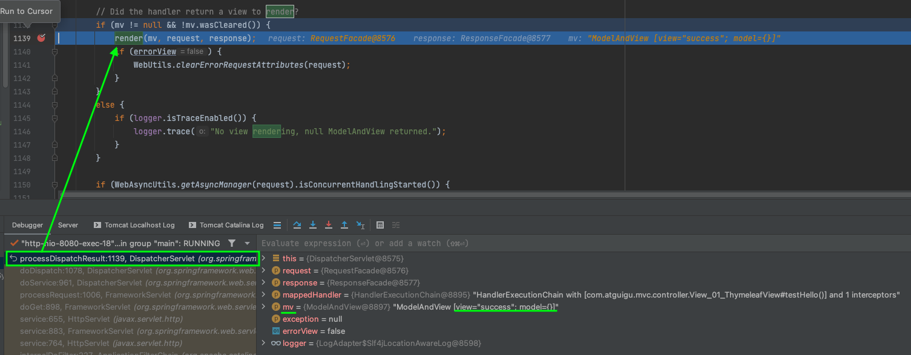
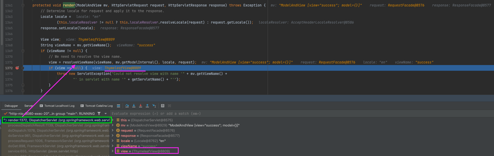
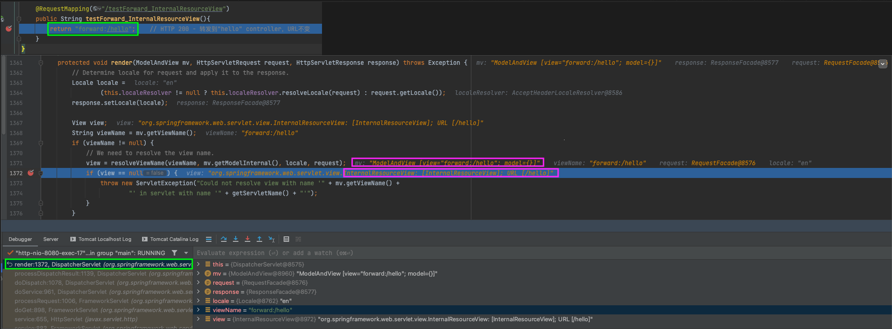
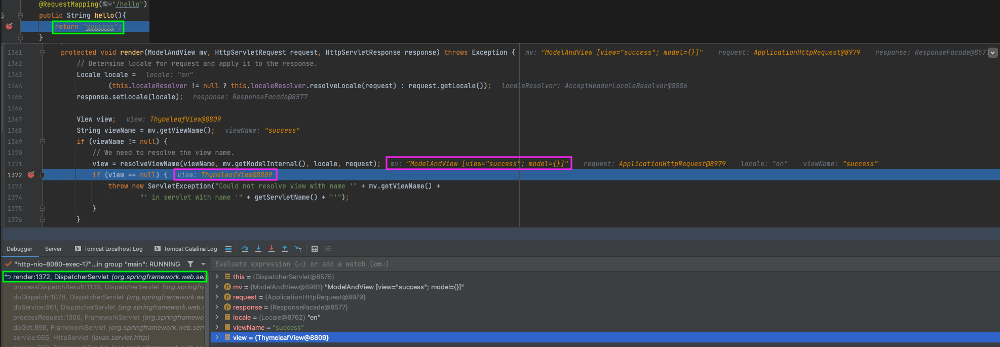
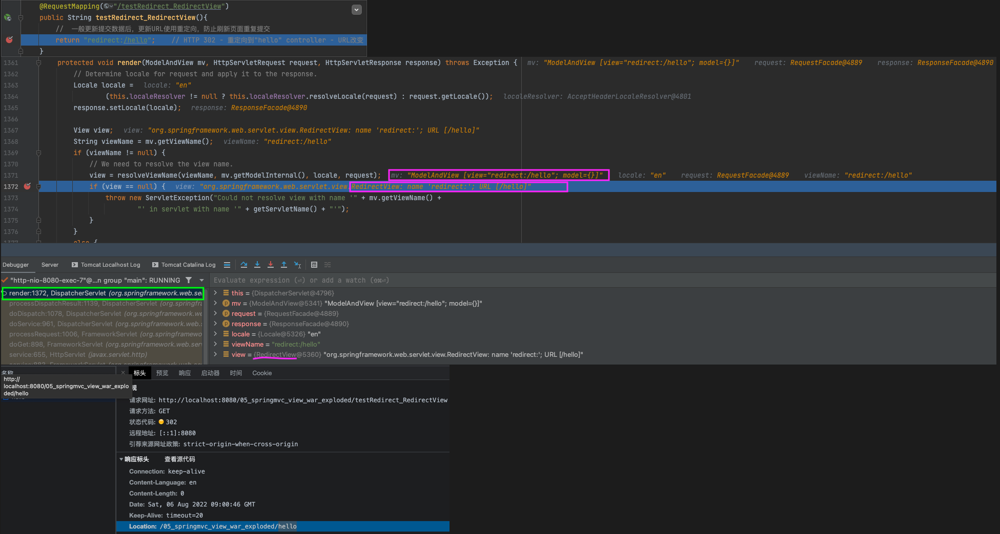
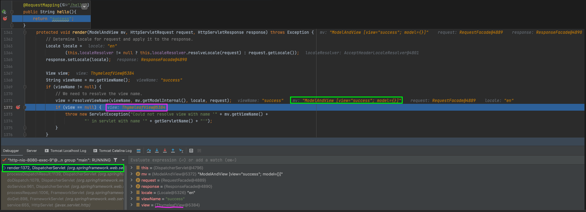

### 五、SpringMVC的视图
SpringMVC中的视图是View接口，视图的作用渲染数据，将模型Model中的数据展示给用户

SpringMVC视图的种类很多，默认有转发视图（InternalResourceView）和重定向视图（RedirectView）

当工程引入jstl的依赖，转发视图会自动转换为JstlView (了解)

若使用的视图技术为Thymeleaf，在SpringMVC的配置文件中配置了Thymeleaf的视图解析器，由此视图解析器解析之后所得到的是ThymeleafView
#### 1、ThymeleafView
当控制器方法中所设置的视图名称没有任何前缀时，此时的视图名称会被SpringMVC配置文件中所配置的视图解析器解析，视图名称拼接视图前缀和视图后缀所得到的最终路径，会通过转发的方式实现跳转
```java
@Controller
public class View_01_ThymeleafView {

    @RequestMapping("/")
    public String index() {
        return "index";
    }

    @RequestMapping("/testThymeleafView")
    public String testHello(){
        return "success";
    }
}
```
```html
<h3>1、ThymeleafView</h3>
<a th:href="@{/testThymeleafView}">测试 "/testThymeleafView -- return "success";" --> success.html</a><br/>
```




#### 2、转发视图（forward）
SpringMVC中默认的转发视图是InternalResourceView

SpringMVC中创建转发视图的情况：

当控制器方法中所设置的视图名称以"forward:"为前缀时，创建InternalResourceView视图，此时的视图名称不会被SpringMVC配置文件中所配置的视图解析器解析，而是会将前缀"forward:"去掉，剩余部分作为最终路径通过转发的方式实现跳转

例如"forward:/"，“forward:/employee”
```java
@Controller
public class View_02_forward_InternalResourceView {

    @RequestMapping("/hello")
    public String hello(){
        return "success";
    }

    @RequestMapping("/testForward_InternalResourceView")
    public String testForward_InternalResourceView(){
        return "forward:/hello";    // HTTP 200 - 转发到"hello" controller，URL不变
    }
}
```
```html
<h3>2、forward - InternalResourceView</h3>
<a th:href="@{/testForward_InternalResourceView}">测试 "/testForward_InternalResourceView -- return "forward:/hello";" --> success.html</a><br/>
```



#### 3、重定向视图（redirect）
SpringMVC中默认的重定向视图是RedirectView

当控制器方法中所设置的视图名称以"redirect:"为前缀时，创建RedirectView视图，此时的视图名称不会被SpringMVC配置文件中所配置的视图解析器解析，而是会将前缀"redirect:"去掉，剩余部分作为最终路径通过重定向的方式实现跳转

例如"redirect:/"，“redirect:/employee”
```java
@Controller
public class View_03_redirect_RedirectView {

    @RequestMapping("/testRedirect_RedirectView")
    public String testRedirect_RedirectView(){
        //  一般更新提交数据后，更新URL使用重定向，防止刷新页面重复提交
        return "redirect:/hello";    // HTTP 302 - 重定向到"hello" controller - URL改变
    }
}
```
```html
<h3>3、redirect - RedirectView</h3>
<a th:href="@{/testRedirect_RedirectView}">测试 "/testRedirect_RedirectView -- return "redirect:/hello";" --> success.html</a><br/>
```



```plain/text
注：
重定向视图在解析时，会先将redirect:前缀去掉，然后会判断剩余部分是否以/开头，若是则会自动拼接上下文路径
转发与重定向的区别：
转发请求，浏览器值显示发送来一条请求（实际服务器内部处理两次），而重定向是浏览器发送两条请求
转发请求，可以访问WEB-INF下的资源，而重定向不可以访问，因为WEB-INF下资源具有安全性，隐藏性，只能通过服务器内部访问，不能通过浏览器访问
转发请求，不能跨域，而重定向可以跨域
```

#### 4、视图控制器view-controller
当控制器方法中，仅仅用来实现页面跳转，即只需要设置视图名称时，可以将处理器方法使用view-controller标签进行表示

```plain/text
注：
当SpringMVC中设置任何一个view-controller时，其他控制器中的请求映射将全部失效，此时需要在SpringMVC的核心配置文件中设置开启mvc注解驱动的标签：
<mvc:annotation-driven />
```