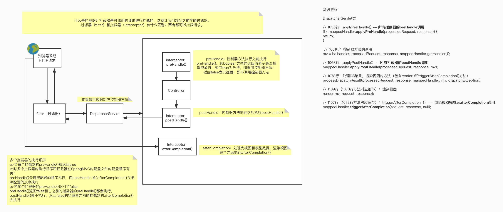

### 十、拦截器
#### 1、拦截器的配置

SpringMVC中的拦截器用于拦截控制器方法的执行

SpringMVC中的拦截器需要实现HandlerInterceptor

SpringMVC的拦截器必须在SpringMVC的配置文件中进行配置：
```xml
<!-- 拦截器配置：Controller Interceptor -->
<mvc:interceptors>
    <!-- 写法1、以下两种bean或ref配置方式都是对DispatcherServlet所处理的所有请求进行拦截
        Option 1、使用关键字bean
        Option 2、使用关键字ref：ref表示引用IoC容器中的某一个bean，需要把FirstInterceptor加上@Component容器托管才能被ref引用bean，作用和上面写法一样
        -->
    <!--        <bean class="com.atguigu.mvc.interceptors.FirstInterceptor"></bean>-->
    <!--        <ref bean="firstInterceptor"></ref>-->

    <!-- 写法2、自定义拦截请求规则
        通过ref或bean标签设置拦截器，
        通过mvc:mapping设置需要拦截的请求，
        通过mvc:exclude-mapping设置需要排除的请求，即不需要拦截的请求
        -->
    <!--        <mvc:interceptor>-->
    <!--            <mvc:mapping path="/*"/> &lt;!&ndash; "/*"表示拦截一层URL路径，二层以上不拦截； "/**"表示拦截所有层级URL &ndash;&gt;-->
    <!--            <mvc:exclude-mapping path="/"/> &lt;!&ndash; 排除"/"index页面，使其不在拦截范围 &ndash;&gt;-->
    <!--            &lt;!&ndash; 拦截器配置使用上面提到的bean或ref写法 &ndash;&gt;-->
    <!--            <ref bean="firstInterceptor"></ref>-->
    <!--        </mvc:interceptor>-->

    <!-- 结合源码调试：
        多个拦截器结合源码调试，全局开启所有请求拦截形式 
        -->
    <ref bean="firstInterceptor"></ref>
    <ref bean="secondInterceptor"></ref>
</mvc:interceptors>
```

#### 2、拦截器的三个抽象方法
SpringMVC中的拦截器有三个抽象方法：

preHandle：控制器方法执行之前执行preHandle()，其boolean类型的返回值表示是否拦截或放行，返回true为放行，即调用控制器方法；返回false表示拦截，即不调用控制器方法

postHandle：控制器方法执行之后执行postHandle()

afterCompletion：处理完视图和模型数据，渲染视图完毕之后执行afterCompletion()

#### 3、多个拦截器的执行顺序
*源码讲解视频：https://www.bilibili.com/video/BV1Ry4y1574R?p=82
_拦截器配置顺序_
```xml
<ref bean="firstInterceptor"></ref>
<ref bean="secondInterceptor"></ref>
```

##### a> 若每个拦截器的preHandle()都返回true

此时多个拦截器的执行顺序和拦截器在SpringMVC的配置文件的配置顺序有关：

preHandle()会按照配置的顺序执行，而postHandle()和afterCompletion()会按照配置的反序执行

_拦截输出结果_
```plain/text
FirstInterceptor --> preHandle
SecondInterceptor --> preHandle
SecondInterceptor --> postHandle
FirstInterceptor --> postHandle
SecondInterceptor --> afterCompletion
FirstInterceptor --> afterCompletion
```

##### b> 若某个拦截器的preHandle()返回了false

preHandle()返回false和它之前的拦截器的preHandle()都会执行，postHandle()都不执行，返回false的拦截器之前的拦截器的afterCompletion()会执行

_拦截输出结果（第二个拦截器preHandle()返回了false）：对应控制器处理无法执行，UI页面视图内容无法显示_
```plain/text
FirstInterceptor --> preHandle
SecondInterceptor --> preHandle
FirstInterceptor --> afterCompletion
```
