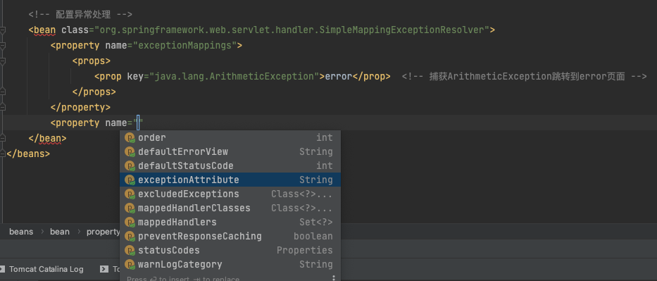

### 十一、异常处理器
#### 1、基于配置的异常处理（xml）
SpringMVC提供了一个处理控制器方法执行过程中所出现的异常的接口：HandlerExceptionResolver

HandlerExceptionResolver接口的实现类有：**DefaultHandlerExceptionResolver** 和 **SimpleMappingExceptionResolver**

SpringMVC提供了自定义的异常处理器**SimpleMappingExceptionResolver**，使用方式：

_springMVC.xml_
```xml
    <!-- 配置异常处理 -->
    <bean class="org.springframework.web.servlet.handler.SimpleMappingExceptionResolver">
        <property name="exceptionMappings">
            <props>
                <!--
                    properties的键表示处理器方法执行过程中出现的异常
                    properties的值表示若出现指定异常时，设置一个新的视图名称，跳转到指定页面
                -->
                <prop key="java.lang.ArithmeticException">error</prop>  <!-- 捕获ArithmeticException跳转到error页面 -->
            </props>
        </property>
        <!--
            exceptionAttribute属性设置一个属性名，将出现的异常信息在请求域中进行共享
        -->
        <property name="exceptionAttribute" value="ex"></property>  <!-- 设置将异常信息共享在请求域中的键，用于视图中展示信息-->
    </bean>
```
_index.html_
```html
<h1>首页</h1>
<h3>测试自定义处理异常解析器，使用继承了HandlerExceptionResolver接口的SpringMVC自定义的异常处理器"SimpleMappingExceptionResolver"</h3>
<a th:href="@{/testHandlerExceptionResolver}">/testHandlerExceptionResolver ，测试处理异常解析，捕获ArithmeticException异常，并解析视图到error页面</a>
```
_error.html_
```html
<h1>异常页</h1>
异常处理解析的页面
<!-- 下行用于显示请求域中的attribute对应的内容信息 -->
<p th:text="${ex}"></p>
```
SimpleMappingExceptionResolver其他API拓展
